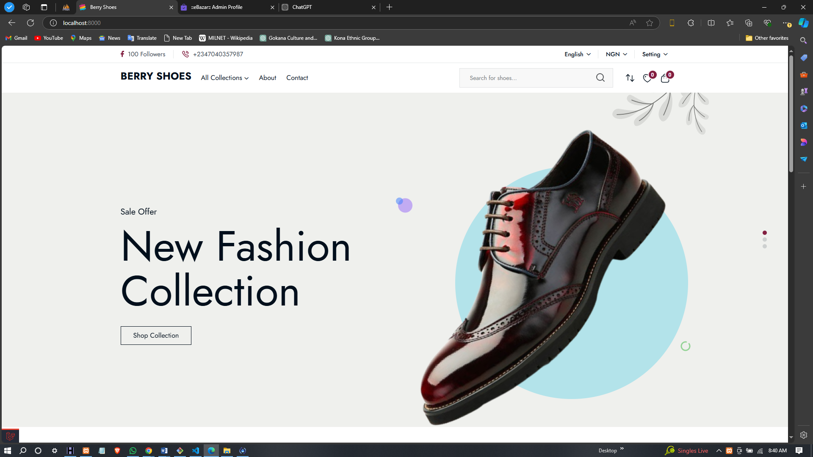
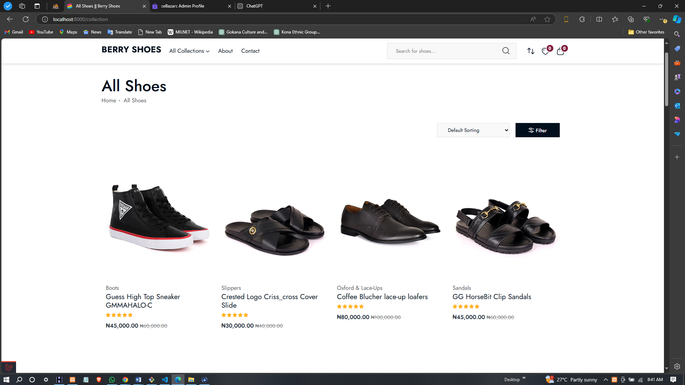
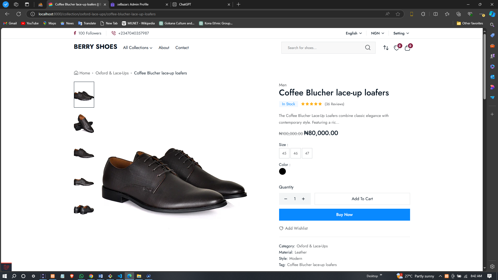
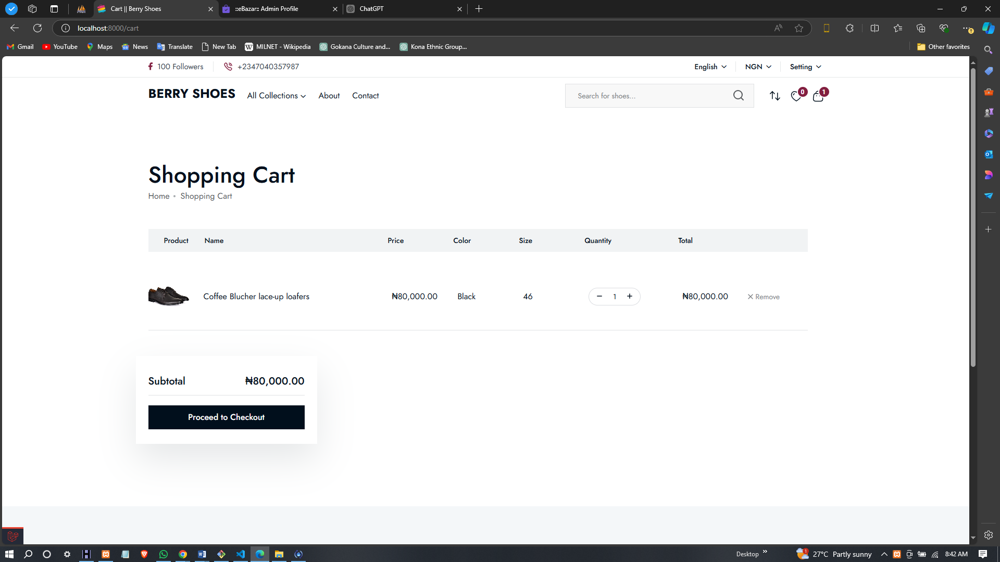
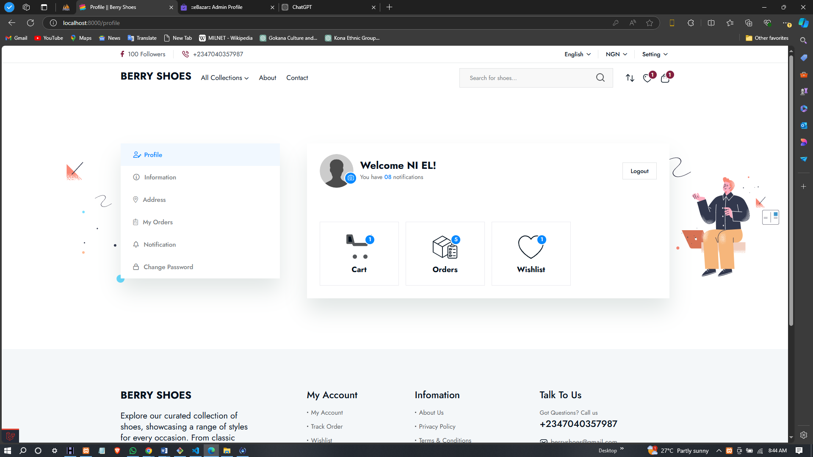
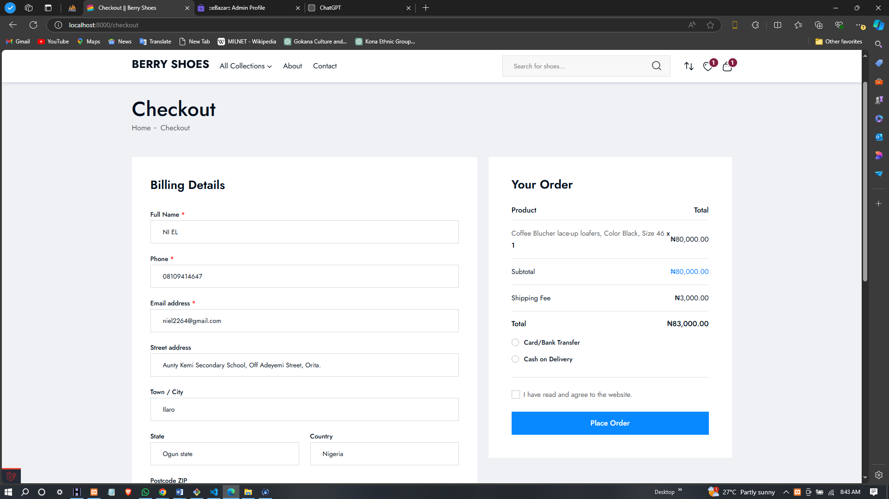
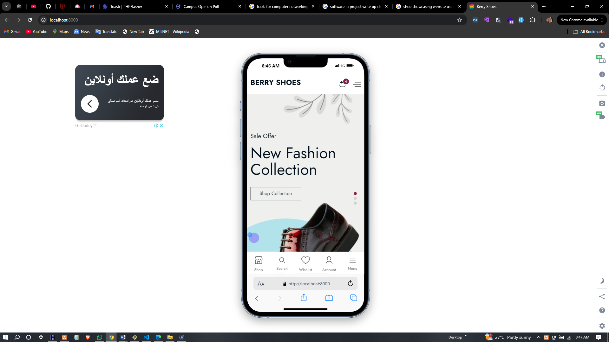
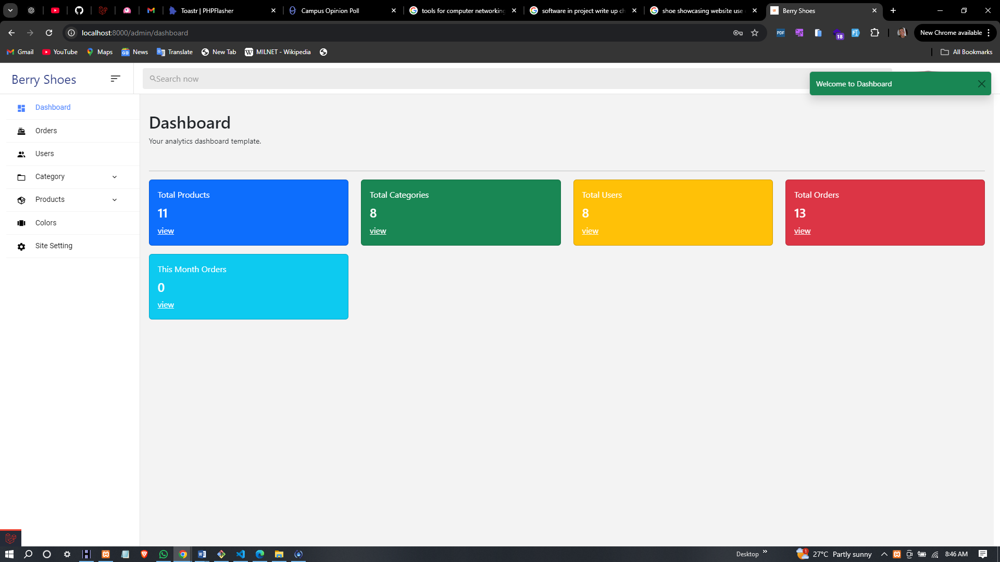

# Shoe Showcasing Website

This web application allows users to browse and manage a wide range of shoe products, offering features for both customers and admins. Built with **Laravel**, **Livewire**, and **Bootstrap**, it ensures a dynamic, responsive, and user-friendly experience.

## Features

### Customer Side
- **User Authentication**: Login and register.
- **Browse Categories**: View shoe categories.
- **View Products**: See products under specific categories.
- **Filter Products**: Filter by brand and price.
- **Product Details**: View images, descriptions, and prices.
- **Color Selection**: Choose color variants.
- **Quantity Adjustment**: Adjust product quantity before checkout.
- **Add to Cart/Wishlist**: Save items for purchase or future reference.
- **Manage Cart/Wishlist**: Update or remove items.
- **Checkout**: Pay via **Paystack** or **Cash on Delivery (COD)**.
- **Order Notifications**: Email notifications for orders.
- **Order History**: View details of previous purchases.
- **User Profile**: Manage account details and change password.

### Admin Side
- **Category Management**: Add, edit, delete categories.
- **Product Management**: Manage products, including multiple images and colors.
- **Brand and Color Management**: CRUD operations for brands and colors.
- **Slider Management**: Manage homepage sliders.
- **Site Settings**: Configure website details, social media links, and contact info.
- **User Management**: Manage users and roles.
- **Order Management**: Track, update, and manage orders and invoices.
- **Dashboard Statistics**: View sales, product, and user statistics.

## Designs and Screenshots

### Home Page  
_A visually appealing homepage featuring a slider showcasing promotions._  

### Product Listing Page  
_A detailed list of shoe categories with thumbnails._  

### Product Details Page  
_Showcasing a product's images, details, and color/size options._  

### Cart Page  
_An interactive cart allowing users to update quantities or remove items._  

### User Account Page  
_Manage user account details._  

### Checkout Page  
_The page where users review their order and finalize the purchase._  

### Login Page  
_A simple login page for users to access their accounts._  

### Mobile View  
_Optimized view for users on mobile devices._  

### Admin Dashboard  
_Insights into orders, products, and user statistics._  

## Technologies Used
- **Laravel**: Backend framework.
- **Livewire**: Real-time dynamic components.
- **Bootstrap**: Responsive front-end framework.

## Contributing
1. Fork the repository.
2. Create a branch for your changes.
3. Commit and push your changes.
4. Open a pull request.

## License
This project is licensed under the **MIT License**. See the [LICENSE](LICENSE) file for details.

## Contact
For questions or feedback, reach out to **niel2264@gmail.com**.
